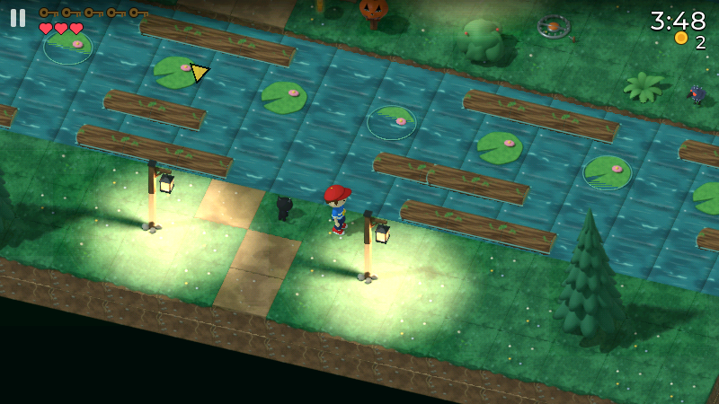
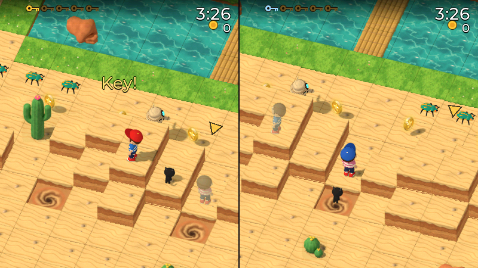
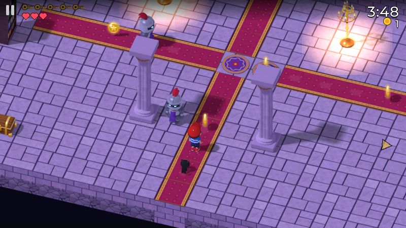

# Monster Hop

Tommy hops across monster lands for the five keys of each level: zombie
streets, a vampire castle, the mummies' desert and the werewolves' forest.
It began as a game for a 1.8" smartwatch
([AmoledOS](https://github.com/charliejgallo/ESP32S3_AmoledOS)), and this is
the same game on macOS and Windows: a wide window, keys and gamepads, and two
players on one screen.



| | |
| --- | --- |
|  |  |
| Two players, one screen: the key race | The vampire castle |

## Download

The [releases](https://github.com/charliejgallo/MonsterHop/releases) have a
zip for each system:

- **macOS 11 or later** (Apple silicon and Intel): unzip and move
  *Monster Hop* to Applications. It is not notarised, so the first time
  right-click it and choose **Open** (or System Settings > Privacy & Security
  > **Open Anyway**).
- **Windows 10 or later**: unzip anywhere and run `MonsterHop.exe`. Keep
  `monsterhop.pak` next to it. SmartScreen may ask the first time: **More
  info** > **Run anyway**.

Progress, the shop and the settings are saved in
`~/Library/Application Support/MonsterHop` (macOS) or
`%APPDATA%\MonsterHop` (Windows).

## Controls

| | Keyboard | Gamepad |
| --- | --- | --- |
| Hop | arrows or WASD (hold to keep hopping) | d-pad or left stick |
| Lever, crate, chest, super hop | Space or Enter | A |
| Pause | Esc or P | Start |
| Back | Backspace | B |
| Menus | arrows and Enter, or the mouse | d-pad and A |
| Full screen | F11, Alt+Enter, or Cmd+Ctrl+F | |

### Two players

In Tommy's house, **Play with a friend** opens the key race: both players on
the same level, each on their own half of the screen and each seeing the other
as a ghost. A key is a point and the first out of the exit gets two more. The
controls are shared out on their own:

| Connected | Player 1 | Player 2 |
| --- | --- | --- |
| no gamepad | WASD + Space | arrows + Enter |
| one gamepad | WASD + Space | the gamepad (or arrows + Enter) |
| two gamepads | the first gamepad (or WASD) | the second (or arrows) |

## Building

CMake 3.20+, Ninja and a C compiler. SDL2 and LVGL 9.5 are downloaded by the
build. The game itself comes from an AmoledOS checkout: CI fetches the commit
in `amoledos.ref`; locally, a checkout next to this repository is used, or
point at one with `-DAMOLEDOS_DIR=`.

```bash
cmake -B build -G Ninja -DCMAKE_BUILD_TYPE=Release
cmake --build build
```

On macOS that makes `build/Monster Hop.app`, and on Windows (MSYS2 MinGW64)
`build/MonsterHop.exe` with `monsterhop.pak` beside it. A tag `v*` makes CI
publish both as a release.

The development switches of the watch's simulator work here too:
`MH_LEVEL=<0..15>` goes straight into a level, `MH_SPLIT=<0..15>` into a
two-player race, `MH_UNLOCK=1` opens every level, and
`MH_SHOT=<prefix> MH_SHOT_AT=<ms,...>` saves the frame as BMPs and quits.

## How it is made

The game's code is the watch's, unchanged in its rules: a worker thread draws
each frame in software (RGB565, pre-rendered 3D sprites tested against a depth
cache) and LVGL shows it with the menus on top. The desktop version draws a
wider frame (800x450: the watch's height and twice its columns) that SDL
scales to the window. The rest is `src/`: the part of the watch's HAL the game
calls, the controls, and the menus driven by keys.

## En castellano

| | |
| --- | --- |
| Qué es | Monster Hop, el juego del reloj AmoledOS, en Mac y Windows |
| Descargar | los zips de *Releases* (Mac: clic derecho > Abrir la primera vez) |
| Jugar | flechas o WASD para saltar, Espacio para la acción, Esc para pausa |
| De a dos | en la casa de Tommy, *Jugar con un amigo*: pantalla dividida, con joysticks o los dos en el teclado |
| Idioma | el del sistema (castellano, inglés o alemán) |

## License

The code is MIT like AmoledOS. The art and music are part of the game and
come with it.
