# Monster Hop

Tommy hops across six monster lands for the five keys of each level: zombie
streets, a vampire castle, the mummies' desert, the werewolves' woods, a
valley of dinosaurs and a bay of sea monsters. It began as a game for a 1.8"
smartwatch ([AmoledOS](https://github.com/charliejgallo/ESP32S3_AmoledOS)),
and this is the same game on macOS and Windows: HD art in a wide window, keys
and gamepads, and two players on one screen.

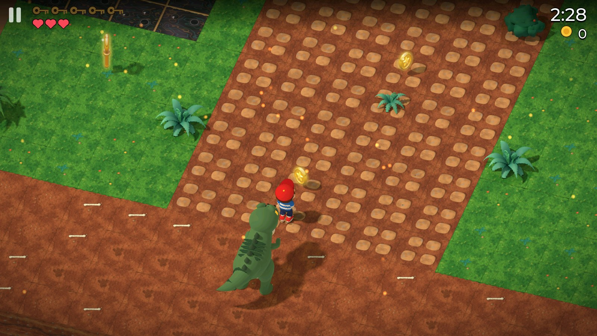

- **24 levels in six worlds**, each ending with a boss: the Brute, the Count,
  the Pharaoh, the Alpha, a T-Rex that chases you and the Kraken.
- **An open map**: the city, the valley, the woods and the bay are there from
  the start; the castle and the desert open with stars.
- **Two players on one screen**: a key race with two gamepads, a gamepad and
  the keyboard, or both on the keyboard (WASD and arrows).
- **HD**: every sprite rendered in Blender at twice the watch's resolution,
  drawn at 1600x900, with far scenery behind each world, glow around lava and
  lamps, and each world's own particles (embers, fireflies, plankton...).
- A house to dress Tommy in, a shop, a sticker album, trophies and stats.
  English, Spanish and German.

## The six worlds

| | |
| --- | --- |
| 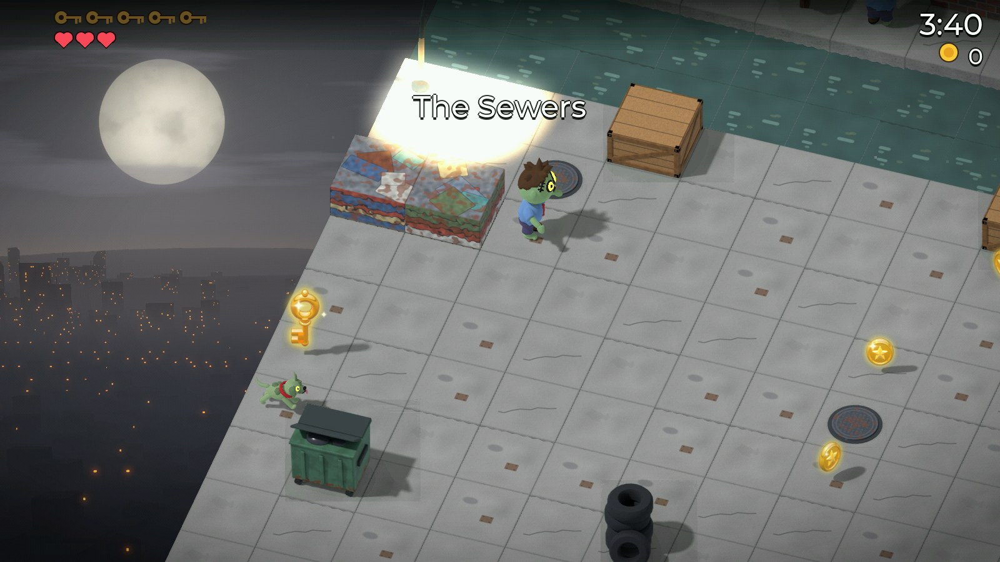 | 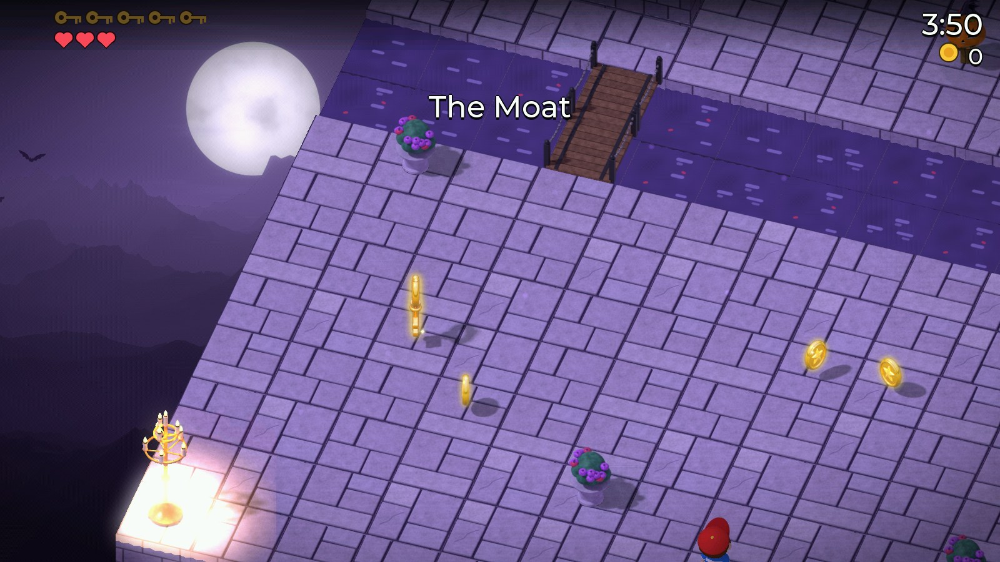 |
| **Zombie Town**: traffic, zombies and their dogs | **Vampire Castle**: bats, suits of armour and spikes |
| 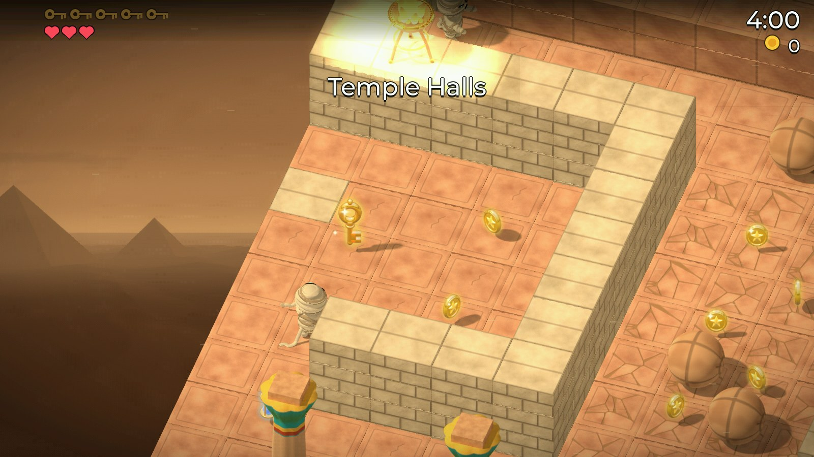 | 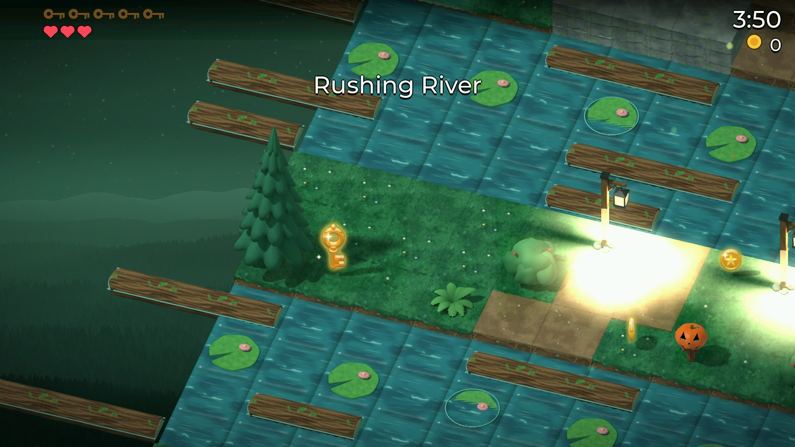 |
| **Mummy Desert**: scarabs, quicksand and the oasis | **Werewolf Woods**: rivers, logs and lily pads |
| 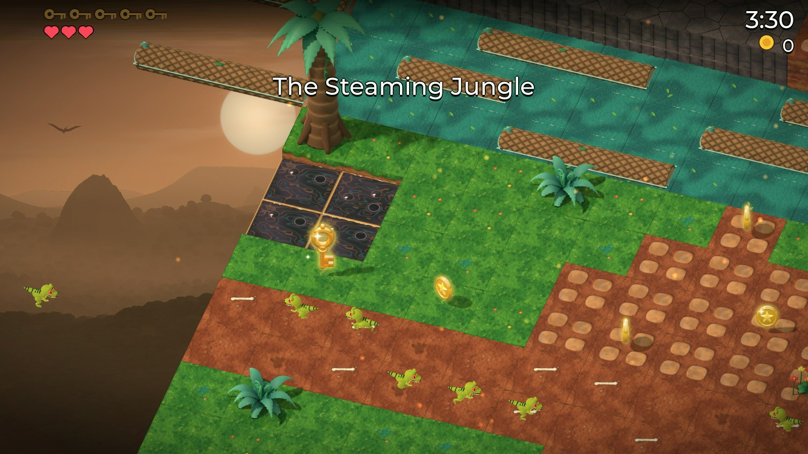 | 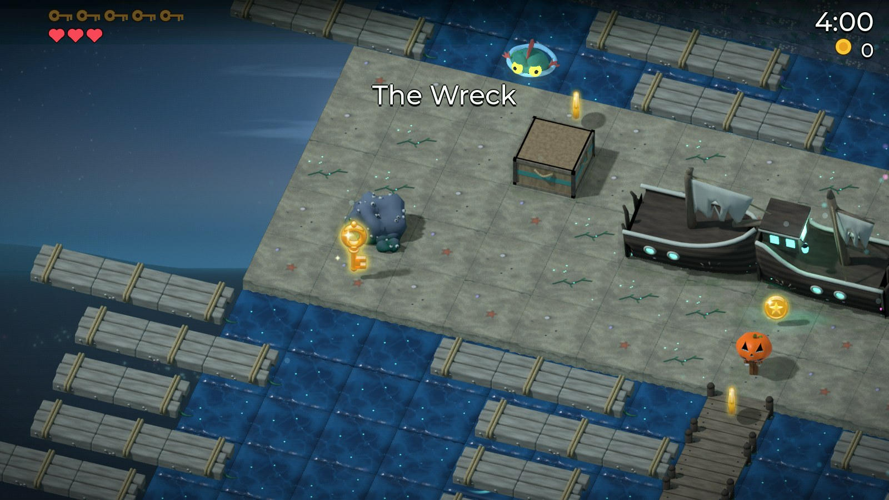 |
| **Lost Valley**: raptors, triceratops, compy packs and timed lava | **Abyss Bay**: fish-men, crabs, jellyfish, tides and whirlpools |

## Two players, one screen

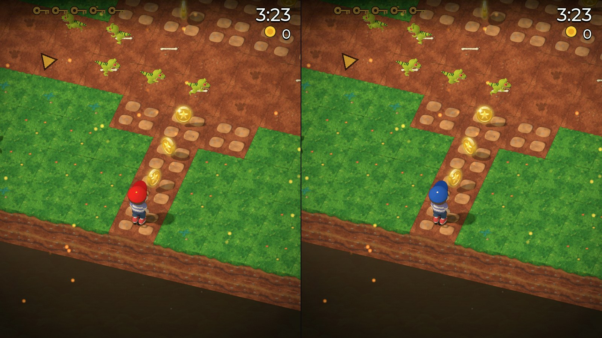

In Tommy's house, **Play with a friend** opens the key race: both players on
the same level, each on their own half of the screen and each seeing the other
as a ghost. A key is a point and the first out of the exit gets two more.

| | |
| --- | --- |
| 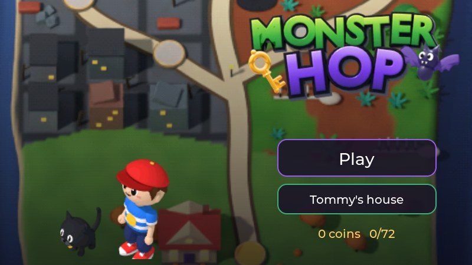 | 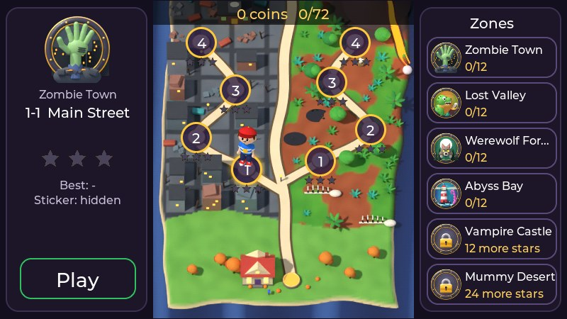 |
| 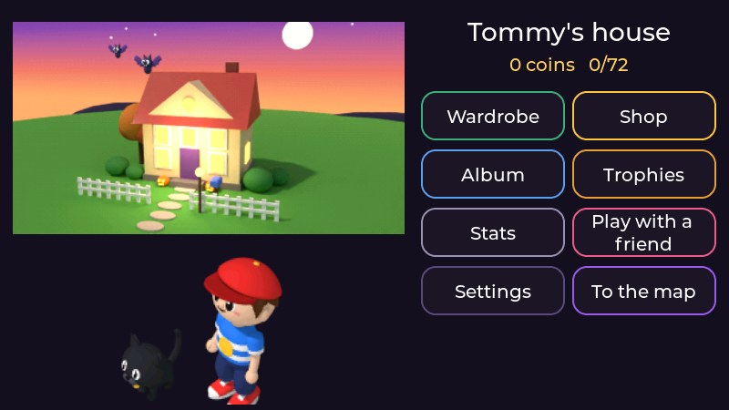 | 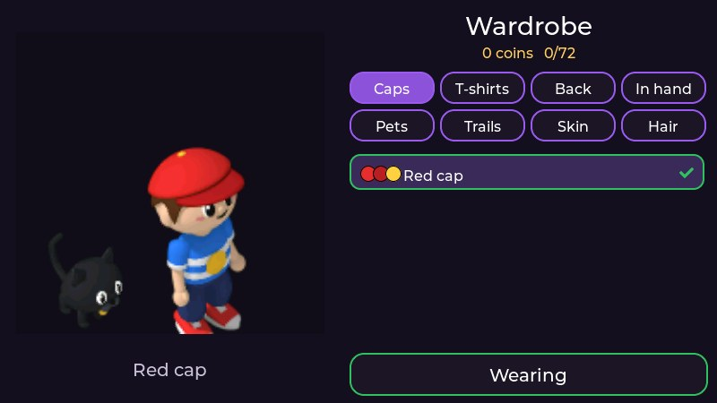 |

## Download

The [releases](https://github.com/charliejgallo/MonsterHop/releases) have a
zip for each system:

- **macOS 11 or later** (Apple silicon and Intel): unzip and move
  *Monster Hop* to Applications. It is not notarised, so the first time
  right-click it and choose **Open** (or System Settings > Privacy & Security
  > **Open Anyway**).
- **Windows 10 or later**: unzip anywhere and run `MonsterHop.exe`. Keep the
  two `.pak` files next to it. SmartScreen may ask the first time: **More
  info** > **Run anyway**.

Progress, the shop and the settings are saved in
`~/Library/Application Support/MonsterHop` (macOS) or
`%APPDATA%\MonsterHop` (Windows).

## Controls

| | Keyboard | Gamepad |
| --- | --- | --- |
| Hop | arrows or WASD (hold to keep hopping) | d-pad or left stick |
| Lever, crate, chest, super hop | Space or Enter | A |
| Pause | Esc or P | Start |
| Back | Backspace | B |
| Menus | arrows and Enter, or the mouse | d-pad and A |
| Full screen | F11, Alt+Enter, or Cmd+Ctrl+F | |

In a race the controls are shared out on their own:

| Connected | Player 1 | Player 2 |
| --- | --- | --- |
| no gamepad | WASD + Space | arrows + Enter |
| one gamepad | WASD + Space | the gamepad (or arrows + Enter) |
| two gamepads | the first gamepad (or WASD) | the second (or arrows) |

## Made in Blender

Nothing in the game is drawn by hand. Every monster, tile and prop is a 3D
model rendered in Blender from the game's fixed isometric camera into sprites
that carry, besides their colour, the depth of each pixel and which part of
the model it belongs to. The game draws them in software against a depth
cache, so a monster walks behind a lamp post and in front of a wall with no
sorting tricks, and it paints each part from a palette, which is how one
zombie model comes in several outfits and Tommy wears whatever the shop sells.

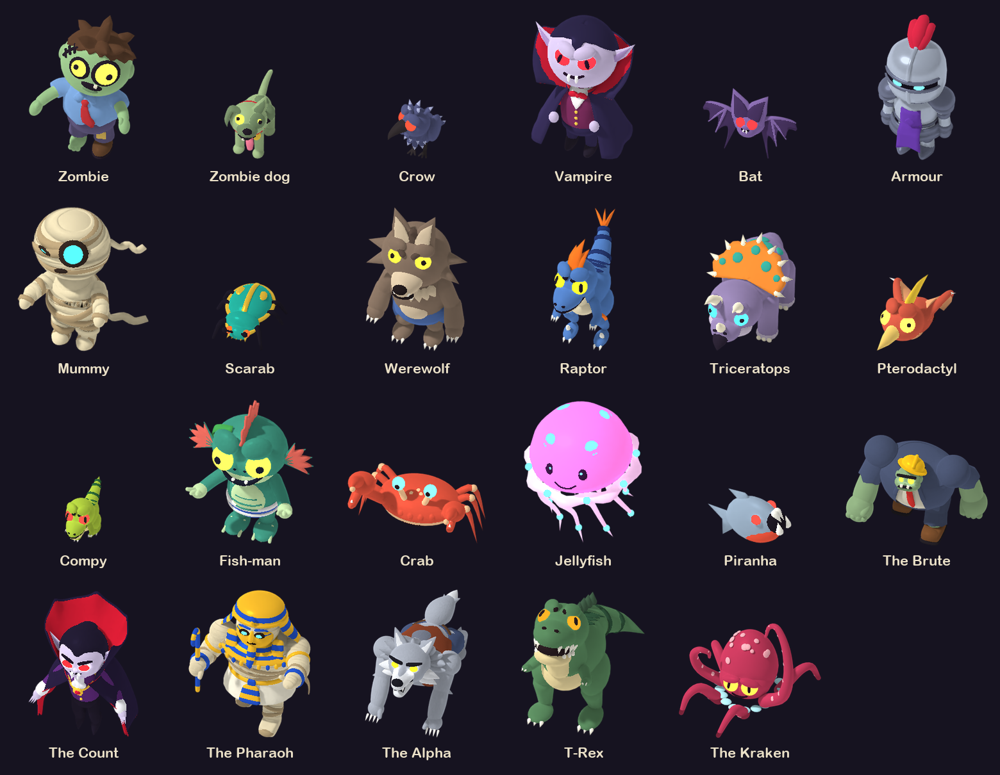

The desktop's HD pack is the same scenes rendered at twice the resolution
(`MH_RES=2`): 1600x900 with the same layout as the watch's 800x450 view, only
sharper.

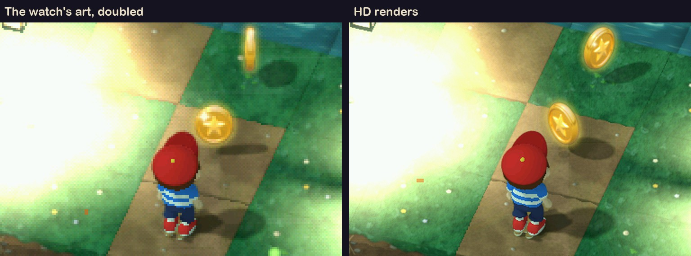

Behind each world sits a far landscape, also rendered in Blender, that moves
at a sixth of the camera's speed:

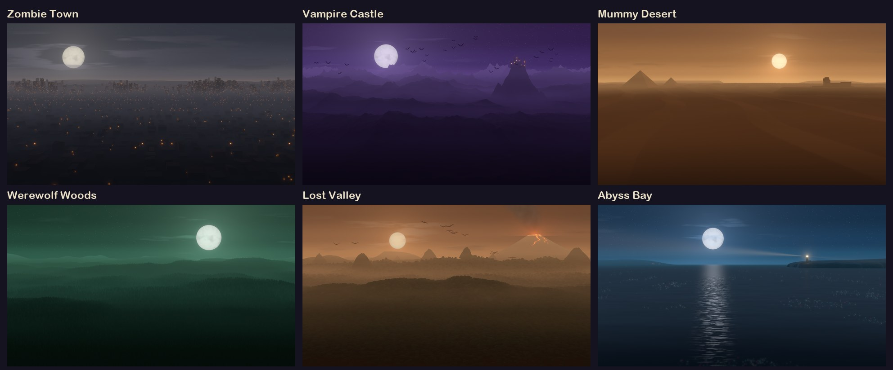

## Building

CMake 3.20+, Ninja and a C compiler. SDL2 and LVGL 9.5 are downloaded by the
build. The game itself comes from an AmoledOS checkout: CI fetches the commit
in `amoledos.ref`; locally, a checkout next to this repository is used, or
point at one with `-DAMOLEDOS_DIR=`.

```bash
cmake -B build -G Ninja -DCMAKE_BUILD_TYPE=Release
cmake --build build
```

On macOS that makes `build/Monster Hop.app`, and on Windows (MSYS2 MinGW64)
`build/MonsterHop.exe` with the packs beside it. A tag `v*` makes CI publish
both as a release.

The art comes in two packs. `monsterhop.pak` is the watch's and is in
AmoledOS. `monsterhop_hd.pak` is built by CI from the HD renders in `art/`
(`art/hd/`, the sprites; `art/backdrops/`, the far scenery) with AmoledOS's
packer:

```bash
MH_HD_ASSETS=$PWD/art/hd MH_BACKDROPS=$PWD/art/backdrops \
  python3 ../ESP32S3_AmoledOS/apps/monsterhop/tools/pack_assets.py --hd
```

After a new render in AmoledOS (`MH_RES=2` with the scripts in
`apps/monsterhop/tools/blender`), `tools/sync_art.sh` copies it into `art/`.
Without the HD pack the game runs with the watch's art at 800x450.

The development switches of the watch's simulator work here too:
`MH_LEVEL=<0..23>` goes straight into a level, `MH_SPLIT=<0..23>` into a
two-player race on that level, `MH_UNLOCK=1` opens every level, `MH_HD=0` uses the watch's
art, `MH_FPS=1` logs frames per second, and
`MH_SHOT=<prefix> MH_SHOT_AT=<ms,...>` saves the frame as BMPs and quits.

## How it is made

The game's code is the watch's, unchanged in its rules: a worker thread draws
each frame in software (RGB565, pre-rendered 3D sprites tested against a depth
cache) and hands it to the window. On the desktop the frame goes to its own
texture under LVGL's menus, so the game can draw at 1600x900 while the menus
stay laid out at 800x450; bloom, the vignette, the particles and the far
scenery are desktop-only touches in the game's code (`MH_DESKTOP`), as are
the wide menus and the split screen. The rest is `src/`: the part of the
watch's HAL the game calls, the controls, and the menus driven by keys.

## En castellano

| | |
| --- | --- |
| Qué es | Monster Hop, el juego del reloj AmoledOS, en Mac y Windows, en HD |
| Mundos | seis: ciudad zombi, castillo, desierto, bosque, Valle Perdido (dinosaurios) y Bahía Abisal (monstruos del agua); 24 niveles con jefes |
| Descargar | los zips de *Releases* (Mac: clic derecho > Abrir la primera vez) |
| Jugar | flechas o WASD para saltar, Espacio para la acción, Esc para pausa |
| De a dos | en la casa de Tommy, *Jugar con un amigo*: pantalla dividida, con joysticks o los dos en el teclado |
| Idioma | el del sistema (castellano, inglés o alemán) |

## Credits

Made by [Charlie Gallo](https://github.com/charliejgallo), with Claude
(Anthropic) writing code, levels and render scripts alongside.

## License

The code is MIT like AmoledOS. The art and music are part of the game and
come with it.
